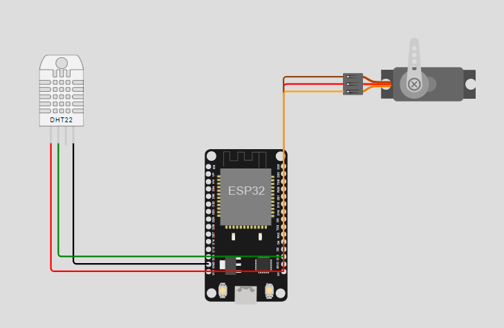
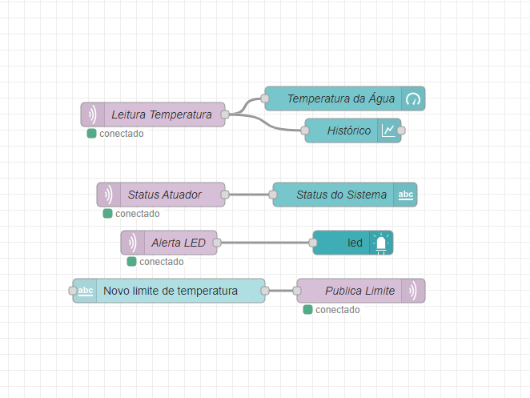
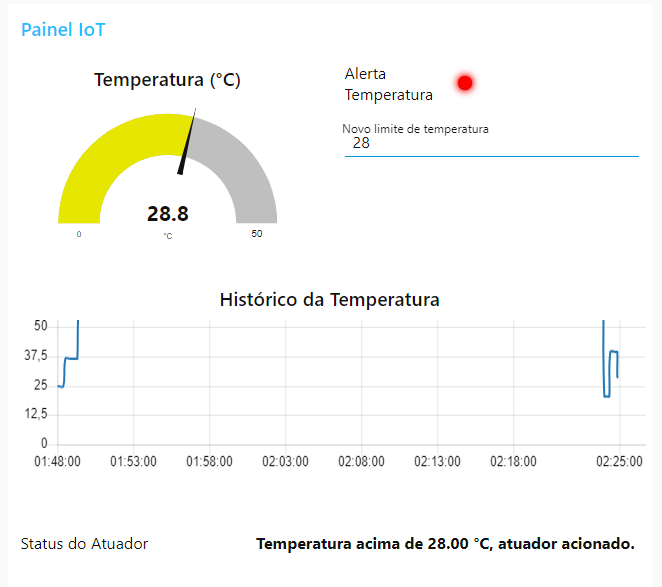

# 💧 Projeto IoT – Monitoramento de Temperatura da Água com MQTT

Este projeto simula um sistema de monitoramento da temperatura da água com ESP32, sensor DHT22 e controle por servo motor. A comunicação é realizada via protocolo MQTT, com visualização e controle por dashboard em Node-RED.

## 🛠 Componentes Utilizados

- ESP32 DevKit v1 (simulado no Wokwi)
- Sensor de temperatura DHT22
- Servo motor SG90
- Plataforma de simulação: [Wokwi](https://wokwi.com/)
- Dashboard de visualização: [Node-RED](https://nodered.org/)
- Broker MQTT: `broker.hivemq.com`

## Funcionamento

1. O DHT22 mede a temperatura da água.
2. A ESP32 publica esse dado no tópico `ods6_iot/agua/temperatura`.
3. Caso ultrapasse o limite (ajustável), um alerta é publicado e o servo é acionado.
4. O status é exibido em tempo real no dashboard Node-RED.

O limite de temperatura pode ser alterado dinamicamente via MQTT através do tópico `ods6_iot/agua/config/limite`.

## 🔗 Tópicos MQTT Utilizados

Veja o arquivo [`mqtt-topicos.md`](mqtt-topicos.md) com a descrição completa.

## Imagens do Projeto

| Descrição | Imagem |
|----------|--------|
| Diagrama do circuito |  |
| Fluxo do Node-RED |  |
| Dashboard |  |

## 📹 Vídeo de Demonstração

[Assista no YouTube (não listado)](https://youtu.be/SEU-LINK-AQUI)

## 📈 Resultados

- Tempo médio entre detecção e envio MQTT: `xx ms`
- Tempo médio entre envio e acionamento do atuador: `yy ms`

(Tabela e gráfico disponíveis na seção de resultados do artigo)

## Estrutura do Repositório

