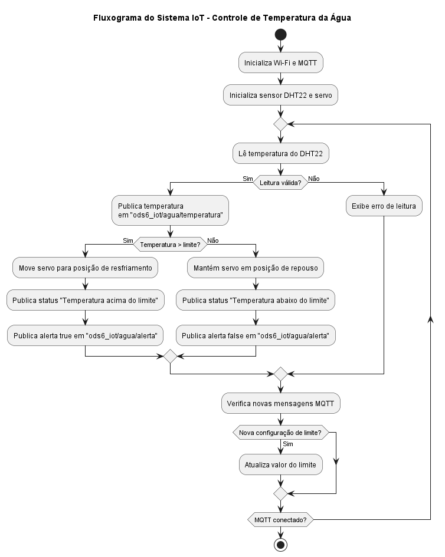

# 💧 Projeto IoT – Monitoramento de Temperatura da Água com MQTT

Este projeto simula um sistema de monitoramento da temperatura da água com ESP32, sensor DHT22 e controle por servo motor. A comunicação é realizada via protocolo MQTT, com visualização e controle por dashboard em Node-RED.

## Demonstração Online

Você pode testar o funcionamento deste projeto diretamente no simulador Wokwi:

[Acessar Projeto no Wokwi](https://wokwi.com/projects/429431266882139137)


## Componentes Utilizados

- ESP32 DevKit v1 (simulado no Wokwi)
- Sensor de temperatura DHT22
- Servo motor SG90
- Plataforma de simulação: [Wokwi](https://wokwi.com/)
- Dashboard de visualização: [Node-RED](https://nodered.org/)
- Broker MQTT: `broker.hivemq.com`

## Funcionamento

1. O DHT22 mede a temperatura da água.
2. A ESP32 publica esse dado no tópico `ods6_iot/agua/temperatura`.
3. Caso ultrapasse o limite (ajustável), um alerta é publicado e o servo é acionado.
4. O status é exibido em tempo real no dashboard Node-RED.

O limite de temperatura pode ser alterado dinamicamente via MQTT através do tópico `ods6_iot/agua/config/limite`.

## Tópicos MQTT Utilizados

Veja o arquivo [`mqtt-topicos.md`](mqtt-topicos.md) com a descrição completa.

## Imagens do Projeto

| Descrição | Imagem |
|----------|--------|
| Diagrama do circuito |  |
| Fluxo do Node-RED |  |
| Fluxo do Node-RED |  |
| Dashboard |  |
| Fluxograma de Funcionamento |  |

## Interfaces e Protocolos

Este projeto utiliza comunicação via protocolo MQTT (Message Queuing Telemetry Transport), com os seguintes detalhes:

- Broker: `broker.hivemq.com`
- Porta: 1883
- Comunicação TCP/IP
- Publicações e assinaturas:
  - `ods6_iot/agua/temperatura` – publicação de temperatura
  - `ods6_iot/agua/status` – status textual
  - `ods6_iot/agua/alerta` – controle de LED
  - `ods6_iot/agua/config/limite` – configuração remota do limite

A troca de mensagens é gerenciada via biblioteca `PubSubClient` e visualizada com o Node-RED.

## Como Executar este Projeto (Wokwi + Node-RED)

### 1. Rodar o Projeto no Wokwi

1. Acesse [o projeto no Wokwi](https://wokwi.com/projects/429431266882139137)
2. Rode a simulação e acompanhe o monitor serial com os dados MQTT sendo publicados.

### 2. Rodar o Dashboard em Node-RED

**Pré-requisitos:**
- Node.js instalado
- Node-RED instalado: `npm install -g --unsafe-perm node-red`
- Plugin: `node-red-contrib-ui-led` instalado pelo Gerenciar Paleta

**Passos:**
1. Rode o Node-RED: `node-red`
2. Acesse [http://localhost:1880](http://localhost:1880)
3. Importe o arquivo `fluxo-node-red.json`
4. Acesse o dashboard: [http://localhost:1880/ui](http://localhost:1880/ui)

## Estrutura do Repositório
```
├── imagens/                 # Imagens do circuito, dashboard e fluxograma
│   ├── circuito-wokwi.png
│   ├── dashboard-nodered.png
│   ├── node-red-fluxo.png
│   └── fluxograma-funcionamento.png
├── sketch.ino               # Código principal do ESP32
├── fluxo-node-red.json      # Fluxo do Node-RED exportado
├── diagram.json             # Diagrama de montagem (Wokwi)
├── libraries.txt            # Bibliotecas utilizadas no Wokwi
├── mqtt-topicos.md          # Descrição dos tópicos MQTT utilizados
├── README.md                # Este arquivo
```
